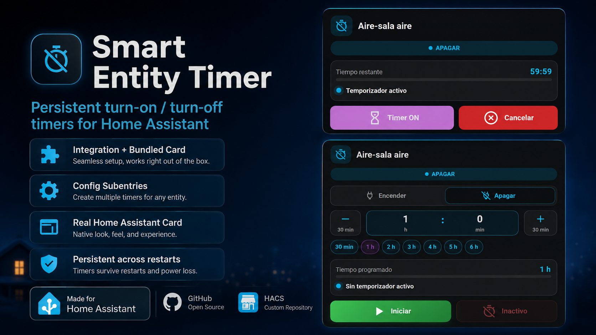
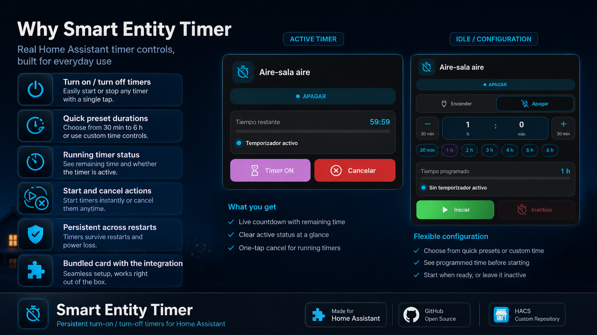
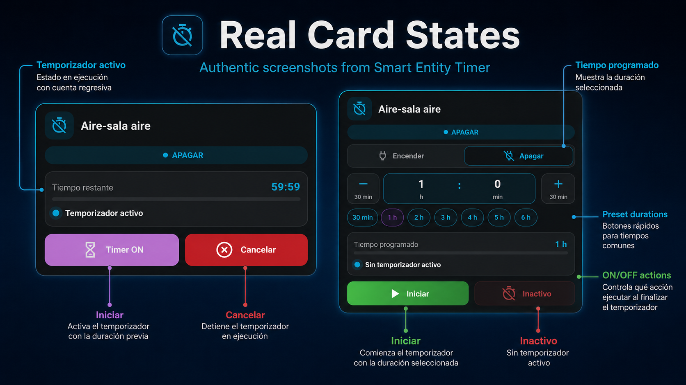
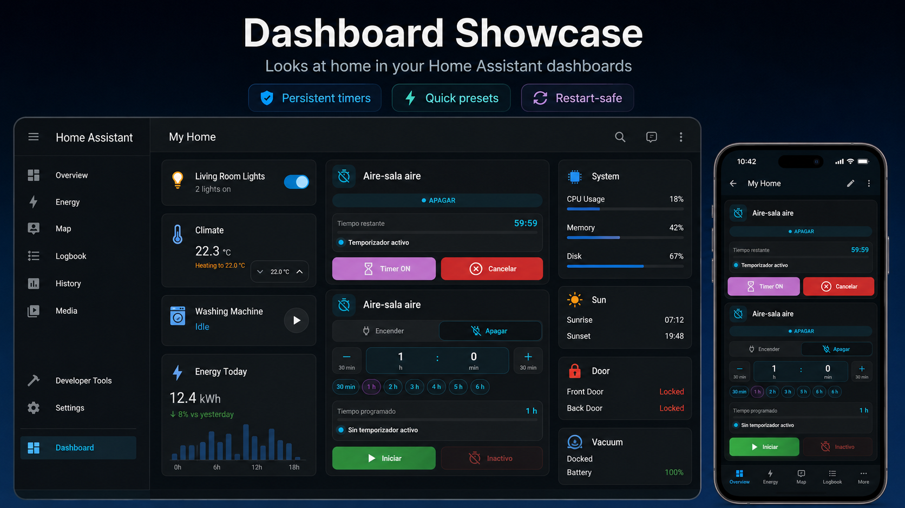

# Smart Entity Timer



Persistent turn-on/turn-off timers for Home Assistant entities, with the dashboard card included in the same HACS integration package.

**Version:** 1.0.3  
**Minimum Home Assistant version:** 2026.7.0  
**Card API:** 2  
**Installation:** one HACS integration package — backend + Smart Entity Timer Card

## Smart Entity Timer 1.0.3

Smart Entity Timer is distributed as one product: installing the integration also installs and registers the **Smart Entity Timer Card**. A separate HACS card download is not required.

Version 1.0.3 is a configuration-translation hotfix. It prevents Home Assistant/FormatJS `MISSING_VALUE` errors when the Add/Reconfigure Timer form displays notification-template examples, adds an explicit `es-419` translation for Latin American Spanish, and adds regression coverage that prevents notification-template syntax from being mistaken for Home Assistant translation arguments. Timer execution, persistence, entity IDs, Config Subentries, services, Card API v2, notification delivery behavior and lifecycle events are unchanged.

```text
Smart Entity Timer
├── Backend
│   ├── one parent integration entry
│   ├── Timer Config Subentries
│   ├── persistent timers
│   ├── notifications
│   └── lifecycle events
└── Bundled dashboard card
    ├── visual editor
    ├── Expanded
    ├── Compact
    ├── Mini
    └── Tile / Mosaico
```

The card keeps the same custom element:

```yaml
type: custom:smart-entity-timer-card
entity: sensor.luz_del_bano_estado
```

## Installation

### HACS — recommended

Install **Smart Entity Timer** from HACS and restart Home Assistant when requested.

The integration contains both:

- the Smart Entity Timer backend; and
- the Smart Entity Timer Card.

Do **not** install Smart Entity Timer Card as a second standalone HACS repository on a clean 1.x installation.

After Home Assistant starts, the integration serves the bundled card and registers it automatically as a Lovelace JavaScript module.

Expected 1.0.3 resource:

```text
/smart_entity_timer_static/smart-entity-timer-card.js?v=1.0.3
```

### Upgrade from 1.0.2

1. Create a Home Assistant backup.
2. Update **Smart Entity Timer** to 1.0.3 from HACS.
3. Restart Home Assistant.
4. Fully reload the browser or close/reopen the Companion App.
5. Open an existing timer's **Configure** flow and confirm the notification-template examples render without frontend translation errors.
6. Existing timers and dashboard cards should continue working without YAML changes.

No timer entity IDs, Config Subentries, persistent storage format, notification-template syntax, lifecycle events, Card API contracts, or dashboard card options are intentionally changed in 1.0.3.

### Upgrade from 0.3.0 + standalone Smart Entity Timer Card

If you still have both old repositories installed:

1. Wait for every Smart Entity Timer timer to become idle.
2. Create a Home Assistant backup.
3. Update Smart Entity Timer to 1.0.3.
4. **Before restarting Home Assistant, remove the standalone Smart Entity Timer Card repository from HACS.**
5. Restart Home Assistant.
6. Fully reload the browser or close/reopen the Companion App.
7. Verify that the existing cards render.

The standalone card is no longer required because the 1.x integration ships and loads the same custom element.

### Manual installation

1. Create a Home Assistant backup.
2. Ensure active Smart Entity Timer timers are idle before an upgrade.
3. Copy `custom_components/smart_entity_timer` into `/config/custom_components/smart_entity_timer`.
4. Replace the existing files.
5. Remove the old standalone Card HACS repository/resource if it is still present.
6. Restart Home Assistant.
7. Fully reload the frontend.

## Why Smart Entity Timer



## Architecture

Smart Entity Timer uses one parent Home Assistant integration entry with one Config Subentry per timer.

```text
Smart Entity Timer
├── Bathroom light timer
├── Air conditioner timer
├── Bedroom fan timer
└── Water heater timer
```

Each timer creates five native Home Assistant entities:

- timer status sensor;
- duration number in whole minutes;
- final-action selector (`turn_on` / `turn_off`);
- start button;
- cancel button.

The timer runs in Home Assistant itself; no dashboard, browser, phone, or tablet needs to remain open.

## Core timer behavior

- Arbitrary whole-minute durations.
- Turn-on or turn-off final action.
- Manual cancellation.
- Automatic cancellation when the target reaches the requested state early.
- Final race-safe state check before execution.
- Persistent restart restoration during normal Home Assistant restarts.
- Expired OFF timers execute after startup by default.
- Expired ON timers are skipped after startup by default for safety.
- Personalized lifecycle notifications.
- Lifecycle events for advanced automations.
- Multiple independent Timer Config Subentries.
- Card API v2.

## Supported domains

`switch`, `light`, `fan`, `climate`, `media_player`, `humidifier`, `input_boolean`, `remote`, and `water_heater`.

# Smart Entity Timer Card



The dashboard card is a first-class part of the Smart Entity Timer package. It is bundled at:

```text
custom_components/smart_entity_timer/www/smart-entity-timer-card.js
```

You can configure it through Home Assistant's visual card editor or directly in YAML.

## Card features

- Select **Turn on** or **Turn off**, or create an ON-only/OFF-only card.
- Enter arbitrary hours and minutes.
- Configurable `−` / `+` minute adjustment buttons.
- Optional quick-duration presets such as 15, 30, 60, and 120 minutes.
- Start and cancel controls with correct enabled/disabled state.
- Live local countdown without writing every second to Home Assistant.
- Automatic synchronization across multiple phones, tablets, and browsers through Card API v2.
- Completion, cancellation, auto-cancellation, restart restoration, skipped-action, and error states.
- Visual editor for normal configuration.
- Expanded, Compact, Mini, and Tile/Mosaico layouts.
- Modern, Flat, and Minimal visual styles.
- Bar, ring, or time-only progress.
- Optional per-control colors that inherit the Home Assistant theme when omitted.

## Dashboard showcase



## Add the card

The simplest configuration is:

```yaml
type: custom:smart-entity-timer-card
entity: sensor.luz_del_bano_estado
```

The `entity` must be the **Timer status / Estado del temporizador** sensor created by Smart Entity Timer.

The minimal configuration preserves the default behavior:

- selectable ON/OFF action;
- automatic layout;
- modern style;
- normal density;
- automatic action-button behavior;
- bar progress;
- automatic time format;
- no quick presets until configured.

## Visual editor

After installing Smart Entity Timer and restarting Home Assistant:

1. Open a dashboard.
2. Enter edit mode.
3. Add a card.
4. Search for **Smart Entity Timer Card**.
5. Select the Smart Entity Timer status sensor.
6. Configure layout, behavior, visibility, colors, quick times, and progress from the editor.

YAML remains available for advanced configurations.

## Layout guide

| Layout | Purpose | Typical relative height |
|---|---|---:|
| `expanded` | Full controls and information | 100% |
| `compact` | Reduced full-width card | ~70–75% |
| `mini` | Mobile-first full timer control | ~45–55% |
| `tile` | Essential quick control / grid use | ~30–40% |
| `auto` | Lets the card use its normal responsive presentation | automatic |

`mini` is recommended for normal phone dashboards. `tile` is useful below a climate card or where several timers share a grid.

### Mini example

```yaml
type: custom:smart-entity-timer-card
entity: sensor.aire_sala_aire_estado
layout: mini
action_mode: turn_off
button_mode: auto
progress_style: bar
quick_times:
  - "30"
  - "60"
  - "120"
  - "180"
show_target_state: false
```

### Tile / Mosaico example

```yaml
type: custom:smart-entity-timer-card
entity: sensor.aire_sala_aire_estado
layout: tile
action_mode: turn_off
button_mode: auto
progress_style: bar
```

Mini and Tile use tight density automatically when `density` is omitted.

## Personalized card example

```yaml
type: custom:smart-entity-timer-card
entity: sensor.luz_del_bano_estado
name: Temporizador baño
icon: mdi:timer-outline
increment_minutes: 30
layout: auto
visual_style: modern
density: normal
action_mode: selectable
button_mode: auto
progress_style: ring
time_format: auto
quick_times:
  - "15"
  - "30"
  - "60"
  - "120"
show_header: true
show_target_state: true
show_action_selector: true
show_duration_controls: true
show_quick_times: true
show_progress: true
show_status: true
show_last_result: true
color_start: [46, 175, 104]
color_timer_active: [74, 112, 245]
color_cancel: [219, 68, 55]
color_inactive: [125, 125, 125]
color_turn_on: [46, 175, 104]
color_turn_off: [232, 132, 61]
color_progress: [74, 112, 245]
color_quick: [120, 120, 120]
color_quick_selected: [92, 75, 219]
```

Every color field is optional. If omitted, the card inherits Home Assistant theme colors.

## Fixed-action cards

A card can expose only one final action.

OFF-only example:

```yaml
type: custom:smart-entity-timer-card
entity: sensor.aire_acondicionado_estado
action_mode: turn_off
layout: compact
visual_style: minimal
progress_style: time
time_format: digital
quick_times:
  - "30"
  - "60"
  - "120"
show_target_state: false
```

When `action_mode` is fixed, the ON/OFF selector is hidden. The fixed action is applied to the backend immediately before starting from that card.

This makes it possible to create different cards for the same timer without changing the backend merely because a card is being displayed.

## Card configuration reference

### General

| Option | Default | Description |
|---|---|---|
| `entity` | required | Smart Entity Timer status sensor using Card API v2. |
| `name` | target name | Optional card title. |
| `icon` | action-dependent | MDI icon. |
| `increment_minutes` | `30` | Amount added/removed by the step buttons. |
| `layout` | `auto` | `auto`, `compact`, `expanded`, `mini`, `tile`. |
| `visual_style` | `modern` | `modern`, `flat`, `minimal`. |
| `density` | layout-dependent | `normal` or `tight`; Mini/Tile use `tight` when omitted. |

### Action and duration

| Option | Default | Description |
|---|---|---|
| `action_mode` | `selectable` | `selectable`, `turn_on`, or `turn_off`. |
| `button_mode` | `auto` | `auto`, `inline`, or `primary_only`. |
| `quick_times` | `[]` | List of quick preset durations in minutes. |
| `progress_style` | `bar` | `bar`, `ring`, or `time`. |
| `time_format` | `auto` | `auto`, `digital`, or `text`. |

`button_mode: auto` keeps Start/Cancel side by side in normal and Mini layouts and shows only the currently useful action in Tile.

To force only the usable action button in any layout:

```yaml
button_mode: primary_only
```

To force reduced spacing:

```yaml
density: tight
```

### Time formats

- `auto`: human-readable programmed duration while idle and digital countdown while active.
- `digital`: clock-style value in both states.
- `text`: values such as `1 h 30 min`; active countdown also includes seconds.

### Visibility

| Option | Default |
|---|---:|
| `show_header` | `true` |
| `show_target_state` | `true` |
| `show_action_selector` | `true` |
| `show_duration_controls` | `true` |
| `show_quick_times` | `true` |
| `show_progress` | `true` |
| `show_status` | `true` |
| `show_last_result` | `true` |

A user can always hide a section. Mini and Tile additionally hide nonessential sections structurally so that they stay compact even when older YAML contains explicit `show_*: true` values.

`show_action_selector` has no visual effect when `action_mode` is fixed.

### Optional colors

The visual editor uses Home Assistant RGB color selectors. Empty values inherit the Home Assistant theme.

| Option | Controls |
|---|---|
| `color_start` | Enabled Start button |
| `color_timer_active` | Disabled Timer ON button while running |
| `color_cancel` | Enabled Cancel button |
| `color_inactive` | Disabled/inactive Start and Inactive states |
| `color_turn_on` | Turn-on selector, badge, and action accents |
| `color_turn_off` | Turn-off selector, badge, and action accents |
| `color_progress` | Progress bar, ring, and time-only value |
| `color_quick` | Unselected quick-duration buttons |
| `color_quick_selected` | Selected quick-duration button |

For advanced YAML use, safe CSS color strings such as `#3366ff`, `rgb(...)`, `hsl(...)`, named colors, and `var(--theme-variable)` are also accepted.

## Visual styles

### Modern

Default style with rounded accent surfaces, soft shadows, gradients, and layered controls.

### Flat

Solid colors, visible borders, flatter corners, no elevation, and no gradients.

### Minimal

Removes most decorative containers, uses tighter spacing and simplified controls while preserving the selected visible sections.

## Progress modes

### Bar

Horizontal elapsed-progress bar with remaining/programmed time.

### Ring

Circular elapsed-progress indicator with the time in the center.

### Time

Shows only the time value and its label.

## Card synchronization contract

Home Assistant remains the single source of truth.

Duration/action changes are written through:

```yaml
action: smart_entity_timer.set_values
target:
  entity_id: sensor.luz_del_bano_estado
data:
  duration_minutes: 90
  end_action: turn_off
```

The status sensor then publishes the authoritative values to every open card. The card does not query the Entity Registry for companion entities during normal operation.

Existing 0.2.x/0.3.0 card YAML remains compatible with Card API v2.

# Backend configuration and automation

## Notifications

Custom notification title/message fields support:

`{timer_name}`, `{target_name}`, `{target_entity}`, `{action}`, `{action_id}`, `{action_past}`, `{duration}`, `{duration_minutes}`, `{result}`, `{reason}`, `{finished_at}`, `{restored}`, `{default_title}`, `{default_message}`.

Leave a custom field blank to preserve the built-in message. In the configuration UI, the supported variable names are listed without literal curly-brace syntax because Home Assistant reserves curly braces in translatable strings for runtime translation arguments. When entering a custom template, use the exact brace syntax shown above.

## Lifecycle events

- `smart_entity_timer.started`
- `smart_entity_timer.completed`
- `smart_entity_timer.cancelled`
- `smart_entity_timer.skipped`
- `smart_entity_timer.error`

## Actions

### Set duration and/or action while idle

```yaml
action: smart_entity_timer.set_values
target:
  entity_id: sensor.luz_del_bano_estado
data:
  duration_minutes: 75
  end_action: turn_off
```

### Start

```yaml
action: smart_entity_timer.start
target:
  entity_id: sensor.luz_del_bano_estado
```

### Cancel

```yaml
action: smart_entity_timer.cancel
target:
  entity_id: sensor.luz_del_bano_estado
```

## Frontend development

The frontend source continues to be developed in:

`abel-smart-timer/smart-entity-timer-card`

That repository remains useful for frontend source history and development. The user-facing 1.x product is distributed from `abel-smart-timer/smart-entity-timer` with the compiled card bundled inside the integration.

## Validation

The 1.0.0 release gate validated the all-in-one architecture on a real Home Assistant installation, including:

- clean HACS installation with only Smart Entity Timer;
- automatic Lovelace resource creation;
- existing dashboard cards without YAML changes;
- creation of new Timer Config Subentries;
- Mini, Tile, Compact, and Expanded layouts;
- start, completion, manual cancel, and external-state auto-cancel;
- restart persistence;
- notifications and lifecycle behavior;
- GitHub Python checks, bundled frontend checks, Hassfest, and HACS validation.

Version 1.0.3 preserves those runtime contracts and adds regression coverage that prevents notification-template variables from becoming config-flow translation placeholders, plus explicit Latin American Spanish (`es-419`) runtime translations.

See `docs/TEST_PLAN_1.0.0.md` for the original all-in-one release-gate procedure.

## License

MIT
